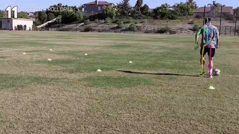
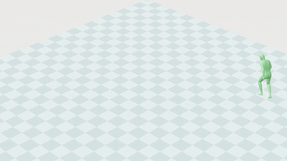

<h1 align="center">GEM: A Generalist Model for Human Motion</h1>

<p align="center">
  <em>Monocular whole-body 3D human pose estimation using the SOMA body model</em>
</p>

<p align="center">
  <a href="https://research.nvidia.com/labs/dair/gem/"></a>
  <a href="https://arxiv.org/abs/2505.01425"></a>
  <a href="LICENSE"></a>
  <a href="https://www.python.org/"></a>
  <a href="https://pytorch.org/"></a>
  <a href="https://developer.nvidia.com/cuda/toolkit"></a>
</p>

---

<p align="center">
  
  
  
</p>
<p align="center">
  <sub>2D Keypoint Overlay &nbsp;|&nbsp; In-Camera Mesh &nbsp;|&nbsp; Global Mesh</sub>
</p>


## Overview

GEM is a video-based 3D human pose estimation model developed by NVIDIA. It recovers full-body 77-joint motion — including body, hands, and face — from monocular video using the [**SOMA**](https://github.com/NVlabs/SOMA-X) parametric body model. The pipeline handles dynamic cameras and recovers global motion trajectories. GEM includes a bundled 2D pose estimation model that detects 77 SOMA keypoints, making the system fully self-contained. Licensed under Apache 2.0 for commercial use.

## Key Features

- **77-joint SOMA body model** — full body, hands, and face articulation
- **Bundled 2D keypoint detector** — 2D pose estimator trained for SOMA 77-joint skeleton
- **Camera-space motion recovery** — camera-space human motion estimation from dynamic monocular video
- **World-space motion recovery** — world-space human motion estimation from dynamic monocular video
- **Apache 2.0 licensed** — commercially usable, trained on NVIDIA-owned data only

## Research Version: Multi-Modal Conditioning

Looking for **multi-modal motion generation** (text, audio, music conditioning)? Check out [**GEM-SMPL**](https://github.com/NVlabs/GENMO), our research model using the SMPL body model that supports both motion estimation and generation from diverse input modalities. Presented at **ICCV 2025 (Highlight)**.

## Quick Start

```bash
# 1. Clone
git clone --recursive https://github.com/NVlabs/GEM-X.git && cd GEM-X

# 2. Setup environment
pip install uv && uv venv .venv --python 3.10 && source .venv/bin/activate
uv pip install torch torchvision --index-url https://download.pytorch.org/whl/cu126
uv pip install -e third_party/soma && cd third_party/soma && git lfs pull && cd ../..
bash scripts/install_env.sh

# 3. Run demo
python scripts/demo/demo_soma.py --video path/to/video.mp4 --ckpt inputs/pretrained/gem_soma.ckpt
```

See [docs/INSTALL.md](docs/INSTALL.md) for detailed installation instructions.

## Documentation

| Document | Description |
|---|---|
| [Installation](docs/INSTALL.md) | Prerequisites, step-by-step setup, Docker, troubleshooting |
| [Demo](docs/DEMO.md) | Full 3D pipeline, 2D keypoint-only demo, output formats |
| [Training & Evaluation](docs/TRAINING.md) | Dataset preparation, training commands, config system |
| [Model Overview](docs/MODEL_OVERVIEW.md) | Architecture, SOMA body model, bundled 2D pose model |
| [Related Projects](docs/RELATED_PROJECTS.md) | GENMO, SOMA, ecosystem cross-references |

## Pretrained Models

| Model | Body Model | Joints | Download |
|---|---|---|---|
| GEM (SOMA) | SOMA | 77 (body + hands + face) | [gem_soma.ckpt](https://huggingface.co/nvidia/GEM-X) |

Place checkpoints under `inputs/pretrained/` or pass the path via `--ckpt`. The demo scripts will automatically download the checkpoint from HuggingFace if `--ckpt` is not provided.

## Related Humanoid Work at NVIDIA
GEM is part of a larger effort to enable humanoid motion data for robotics, physical AI, and other applications.

Check out these related works:
* [GENMO](https://github.com/NVlabs/GENMO)
* [SOMA Body Model](https://github.com/NVlabs/SOMA-X)
* [BONES-SEED Dataset]()
* [ProtoMotions](https://github.com/NVlabs/ProtoMotions)
* [SOMA Retargeter]()
* [SONIC](https://github.com/NVlabs/GR00T-WholeBodyControl)
* [Kimodo](https://github.com/nv-tlabs/kimodo)


## Citation

```bibtex
@inproceedings{genmo2025,
  title     = {GENMO: A GENeralist Model for Human MOtion},
  author    = {Li, Jiefeng and Cao, Jinkun and Zhang, Haotian and Rempe, Davis and Kautz, Jan and Iqbal, Umar and Yuan, Ye},
  booktitle = {Proceedings of the IEEE/CVF International Conference on Computer Vision (ICCV)},
  year      = {2025}
}
```


## License

This project is released under [Apache 2.0](LICENSE). This project will download and install additional third-party open source software projects. Review the license terms of these open source projects before use. See [ATTRIBUTIONS.md](ATTRIBUTIONS.md) for specifics. 

## GOVERNING TERMS: 

Use of the source code is governed by the [Apache License](https://huggingface.co/datasets/choosealicense/licenses/blob/main/markdown/apache-2.0.md), Version 2.0. Use of the associated model is governed by the [NVIDIA Open Model License Agreement](https://www.nvidia.com/en-us/agreements/enterprise-software/nvidia-open-model-license/). 
